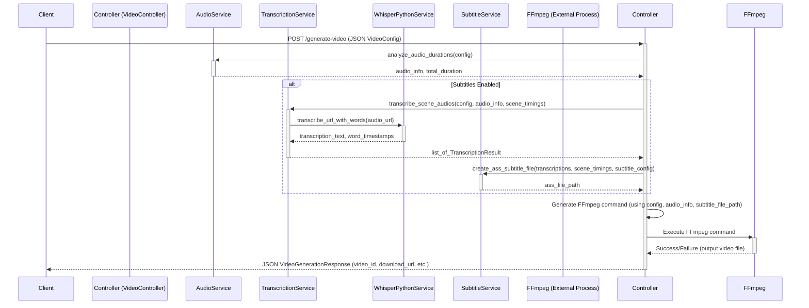
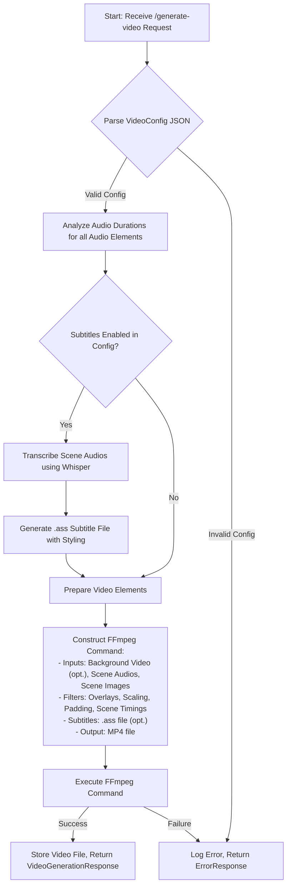

# Video Generator Server

## 1. Introduction

The Video Generator Server is a powerful and flexible Flask-based application designed to dynamically create videos from JSON configurations. It allows users to define video structures programmatically, including scenes, audio tracks, image overlays, background videos, and automatically generated subtitles.

This server streamlines the process of video creation by automating the complex tasks of audio synchronization, element positioning, subtitle generation, and video encoding via FFmpeg. It's ideal for use cases requiring automated video production, such as dynamic content generation for social media, personalized video messages, or programmatic video advertising. By providing a simple API, it can be easily integrated into larger workflows and applications.

## 2. Features

This server offers a rich set of features to control the video generation process:

*   **JSON-Powered Video Blueprints:** Define entire videos, including multiple scenes, media elements, and their properties, using a comprehensive JSON structure.
*   **Scene-Based Composition:** Structure videos into distinct scenes, each with its own set of elements and background.
*   **Advanced Audio Handling:**
    *   Concatenate multiple audio files per scene or across scenes.
    *   Automatically analyze audio durations to precisely time scenes.
    *   Supports fetching audio from direct URLs and Google Drive links.
*   **Image Integration:**
    *   Overlay static images onto scenes with precise X/Y positioning.
*   **Background Video Support:**
    *   Utilize a video as a dynamic background for the entire composition, with controls for volume and resizing.
*   **Automated Subtitle Generation:**
    *   Leverages the OpenAI Whisper model for accurate audio transcription.
    *   Generates subtitles in the Advanced SubStation Alpha (.ass) format.
    *   **Rich Styling:** Customize subtitle appearance including font family, size, word color, line color, outline, shadow, and background box.
    *   **Flexible Positioning:** Place subtitles at various screen locations (e.g., center-top, left-bottom).
    *   **Display Styles:** Supports "classic" full-line subtitles and "progressive" (word-by-word highlight) styles.
*   **FFmpeg Powered Encoding:** Relies on FFmpeg for robust and efficient video processing and encoding into MP4 format.
*   **Comprehensive API:**
    *   **Asynchronous video generation** with job queue and progress tracking
    *   Endpoints to generate new videos, download completed videos, check generation status, list available videos, and delete videos.
    *   **Job management** with status polling, cancellation, and statistics
*   **Health & System Monitoring:**
    *   Includes endpoints for basic health checks (`/health`), detailed system status (`/health/detailed`), performance metrics (`/metrics`), and Kubernetes readiness/liveness probes.
*   **Dockerized for Easy Deployment:**
    *   Comes with a `Dockerfile` for building a containerized version of the application, simplifying deployment and ensuring consistent environments.
    *   Includes FFmpeg and all necessary dependencies within the Docker image.
*   **Configuration Flexibility:**
    *   Configure application behavior through environment variables.
    *   Detailed video parameters are controlled via the input JSON.
*   **File Management & Cleanup:**
    *   Manages generated video files and temporary artifacts.
    *   Includes an automated cleanup service to remove old files.

## 3. Data Flow & Architecture

The Video Generator Server is a Flask application that processes video generation requests through a series of services. The core architecture involves controllers handling API requests, services performing specific tasks like audio analysis and subtitle generation, and FFmpeg as the backbone for video processing.

### 3.1. Request Lifecycle for `/generate-video`

The following sequence diagram illustrates the typical flow when a client posts a new video configuration:



### 3.2. Internal Video Generation Process

The flowchart below outlines the key steps involved in generating a video once a valid configuration is received:


This process involves parsing the input, preparing all media assets, generating subtitles if requested, and then programmatically constructing and executing a complex FFmpeg command to stitch everything together into the final video.

## 4. Getting Started

To get the Video Generator Server up and running, you have two main options: using Docker (recommended for ease of use and environment consistency) or running it directly with Python.

**Prerequisites:**

*   **Docker:** Required if you choose the Docker-based setup. (Install from [docker.com](https://www.docker.com/get-started))
*   **Python:** Version 3.13 or newer is required for running directly.
*   **FFmpeg:** Must be installed and accessible in your system's PATH if running directly. The Docker image includes FFmpeg.
*   **Git:** For cloning the repository.

---

### 4.1. Using Docker (Recommended)

Docker encapsulates the application, its dependencies (including FFmpeg and Whisper models), and configurations, making it the simplest way to get started.

1.  **Clone the Repository:**
    ```bash
    git clone https://github.com/activadee/ffmpeg-dialogue.git 
    cd ffmpeg-dialogue 
    ```

2.  **Build the Docker Image:**
    From the root of the project directory, run:
    ```bash
    docker build -t video-generator .
    ```
    This command builds the image using the provided `Dockerfile`, which installs all necessary system dependencies, Python packages, and sets up Whisper.

3.  **Run the Docker Container:**
    ```bash
    docker run -d -p 3002:3002 \
           -v ./generated_videos:/app/generated_videos \
           --name video-generator-app \
           video-generator
    ```
    *   `-d`: Runs the container in detached mode.
    *   `-p 3002:3002`: Maps port 3002 on your host to port 3002 in the container.
    *   `-v ./generated_videos:/app/generated_videos`: (Optional, but recommended) Mounts a local directory (`./generated_videos`) to the container's output directory. This ensures that generated videos persist even if the container is stopped or removed. Create the `generated_videos` directory on your host if it doesn't exist.
    *   `--name video-generator-app`: Assigns a name to the container for easier management.

4.  **Accessing the Server:**
    The server should now be running and accessible at `http://localhost:3002`. You can check the root endpoint `/` or the health endpoint `/health`.

---

### 4.2. Running Directly with Python

This method requires you to manage dependencies and environment setup manually.

1.  **Clone the Repository:**
    ```bash
    git clone https://github.com/activadee/ffmpeg-dialogue.git 
    cd ffmpeg-dialogue 
    ```

2.  **Install FFmpeg:**
    Ensure FFmpeg is installed on your system and that the `ffmpeg` command is available in your PATH. You can download it from [ffmpeg.org](https://ffmpeg.org/download.html) or install it using your system's package manager (e.g., `apt-get install ffmpeg` on Debian/Ubuntu, `brew install ffmpeg` on macOS).

3.  **Set up a Python Environment:**
    It's recommended to use a virtual environment:
    ```bash
    python3 -m venv venv
    source venv/bin/activate  # On Windows: venv\Scripts\activate
    ```

4.  **Install Python Dependencies:**
    ```bash
    pip install -r requirements.txt
    ```
    This will install Flask, Pydantic, OpenAI Whisper, PyTorch, and other necessary packages. Note that PyTorch can be a large download.

5.  **Configure Environment Variables:**
    The application uses environment variables for configuration. At a minimum, you might want to set:
    ```bash
    export FLASK_ENV=development
    export VIDEO_GENERATOR_DEBUG=true
    export VIDEO_GENERATOR_PORT=3002
    export OUTPUT_DIR=./generated_videos
    # For Whisper model caching (optional, but recommended for first run)
    export WHISPER_CACHE_DIR=./whisper_cache 
    ```
    Ensure the `OUTPUT_DIR` and `WHISPER_CACHE_DIR` (if set) directories exist or the application has rights to create them. Refer to the **Configuration** section for a more comprehensive list of environment variables.

6.  **Run the Application:**
    ```bash
    python run.py
    ```

7.  **Accessing the Server:**
    The server will be accessible at `http://localhost:3002` (or the port you configured).

## 5. API Authentication

All video generation endpoints require API key authentication to prevent unauthorized access.

### 5.1. Setting up Authentication

**Environment Variable:**
```bash
export API_KEY="your-secure-api-key-here"
```

**Docker:**
```bash
docker run -e API_KEY="your-secure-api-key-here" video-generator
```

### 5.2. Using the API Key

Include the API key in your request headers:
```
X-API-Key: your-secure-api-key-here
```

**Example Request:**
```bash
curl -X POST http://localhost:3002/generate-video \
  -H "Content-Type: application/json" \
  -H "X-API-Key: your-secure-api-key-here" \
  -d @video-config.json
```

### 5.3. Development Mode

In development mode (`DEBUG=true`), authentication can be skipped if no API key is configured. This is for local development only.

### 5.4. Error Responses

- **401 Unauthorized**: Missing or invalid API key
- **500 Internal Server Error**: API key not configured in production

## 6. API Endpoints

The Video Generator Server exposes RESTful API endpoints for managing and generating videos. The default base URL is `http://localhost:3002` unless configured otherwise.

**Note:** All video endpoints require API key authentication (see section 5).

---

### 6.1. `POST /generate-video`

Initiates asynchronous video generation based on the provided JSON configuration. Returns immediately with a job ID for status tracking.

*   **Request Body:** `application/json`
*   **Description:** The body must be a JSON object conforming to the `VideoConfig` structure. This object defines all aspects of the video to be generated, including global settings, scenes, and elements within those scenes.

**`VideoConfig` JSON Structure:**

```json
{
  "comment": "Optional description for the video job",
  "resolution": "custom",
  "quality": "high",
  "width": 1920,
  "height": 1080,
  "elements": [
    {
      "type": "video",
      "src": "https://example.com/path/to/background.mp4",
      "z_index": -1,
      "volume": 0.5,
      "resize": "fit",
      "duration": null
    },
    {
      "type": "subtitles",
      "language": "en",
      "settings": {
        "style": "progressive",
        "font-family": "Arial",
        "font-size": 48,
        "word-color": "#FFFFFF",
        "line-color": "#CCCCCC",
        "outline-color": "#000000",
        "outline-width": 3,
        "shadow-color": "#00000080",
        "shadow-offset": 2,
        "box-color": "#000000A0",
        "position": "center-bottom"
      }
    }
  ],
  "scenes": [
    {
      "id": "scene_1",
      "background_color": "transparent",
      "elements": [
        {
          "type": "audio",
          "src": "https://example.com/path/to/audio1.mp3"
        },
        {
          "type": "image",
          "src": "https://example.com/path/to/image1.png",
          "x": 100,
          "y": 50
        }
      ]
    },
    {
      "id": "scene_2",
      "elements": [
        {
          "type": "audio",
          "src": "https://example.com/path/to/audio2.wav"
        }
      ]
    }
  ]
}
```

**Key `VideoConfig` fields:**

*   `comment` (string, optional): A description or identifier for the video job.
*   `resolution` (string, default: "custom"): Video resolution. If "custom", `width` and `height` are required.
*   `quality` (string, default: "high"): Video quality ("high", "medium", "low").
*   `width` (integer): Output video width. Required if `resolution` is "custom".
*   `height` (integer): Output video height. Required if `resolution` is "custom".
*   `elements` (array, optional): Global elements that apply to the entire video.
    *   **`VideoElement`** (`type: "video"`):
        *   `src` (string): URL to the background video file.
        *   `z_index` (integer, default: -1): Stacking order.
        *   `volume` (float, default: 0.5): Volume of the background video (0.0 to 1.0).
        *   `resize` (string, default: "fit"): Resize mode.
        *   `duration` (float, optional): Force duration.
    *   **`SubtitleElement`** (`type: "subtitles"`):
        *   `language` (string, default: "en"): Language code for transcription.
        *   `settings` (object): `SubtitleSettings` object.
            *   `style` (string, default: "progressive"): "progressive" or "classic".
            *   `font-family` (string, default: "Arial").
            *   `font-size` (integer, default: 24).
            *   `word-color` (string, hex, default: "#FFFFFF"): Primary text color.
            *   `line-color` (string, hex, default: "#FFFFFF"): Secondary text color (for progressive style).
            *   `outline-color` (string, hex, default: "#000000").
            *   `outline-width` (integer, default: 3).
            *   `shadow-color` (string, hex, default: "#000000").
            *   `shadow-offset` (integer, default: 2).
            *   `box-color` (string, hex, default: "#000000"): Background box color for subtitles.
            *   `position` (string, default: "center-top"): Subtitle position. Valid positions: `left-bottom`, `center-bottom`, `right-bottom`, `left-center`, `center-center`, `right-center`, `left-top`, `center-top`, `right-top`.
*   `scenes` (array): List of `Scene` objects.
    *   **`Scene`** object:
        *   `id` (string): Unique identifier for the scene.
        *   `background_color` (string, default: "transparent"): Scene background color (hex or "transparent").
        *   `elements` (array): Elements specific to this scene.
            *   **`AudioElement`** (`type: "audio"`):
                *   `src` (string): URL to the audio file for this scene. Duration is automatically detected.
            *   **`ImageElement`** (`type: "image"`):
                *   `src` (string): URL to the image file.
                *   `x` (integer): X-coordinate of the top-left corner.
                *   `y` (integer): Y-coordinate of the top-left corner.

**Success Response (202 Accepted):**

Returns a job initiation response:

```json
{
  "success": true,
  "job_id": "xxxxxxxx-xxxx-xxxx-xxxx-xxxxxxxxxxxx",
  "video_id": "xxxxxxxx-xxxx-xxxx-xxxx-xxxxxxxxxxxx",
  "status": "pending",
  "message": "Video generation started",
  "status_url": "/jobs/xxxxxxxx-xxxx-xxxx-xxxx-xxxxxxxxxxxx/status"
}
```

**Error Responses:**

*   **400 Bad Request:** If the JSON configuration is invalid. (`ErrorResponse` JSON).
*   **500 Internal Server Error:** If an unexpected error occurs. (`ErrorResponse` JSON).

---

### 6.2. `GET /jobs/<job_id>/status`

Check the status and progress of an asynchronous video generation job.

*   **URL Parameters:** `job_id` (string) - The job ID returned from `/generate-video`
*   **Success Response (200 OK):** Job status information

```json
{
  "job_id": "xxxxxxxx-xxxx-xxxx-xxxx-xxxxxxxxxxxx",
  "video_id": "xxxxxxxx-xxxx-xxxx-xxxx-xxxxxxxxxxxx",
  "status": "processing",
  "progress": 75,
  "current_step": "Generating video with FFmpeg",
  "created_at": "2024-01-01T12:00:00.000000",
  "updated_at": "2024-01-01T12:02:30.000000",
  "started_at": "2024-01-01T12:00:05.000000",
  "duration_seconds": 145.5,
  "download_url": "/download/xxxxxxxx-xxxx-xxxx-xxxx-xxxxxxxxxxxx"
}
```

**Job Status Values:**
- `pending` - Job created, waiting for processing
- `processing` - Video generation in progress
- `completed` - Video generated successfully, ready for download
- `failed` - An error occurred during generation
- `cancelled` - Job was cancelled by user

**Progress Steps:**
- 10%: Analyzing audio files
- 20%: Audio analysis complete  
- 30%: Transcribing audio
- 50%: Generating subtitles
- 60%: Preparing video generation
- 70%: Generating video with FFmpeg
- 95%: Finalizing video
- 100%: Completed

*   **Errors:** 400 (invalid job ID), 404 (job not found), 500

---

### 6.3. `GET /jobs`

List all video generation jobs with optional status filtering.

*   **Query Parameters:** 
    - `status` (string, optional) - Filter by job status (`pending`, `processing`, `completed`, `failed`, `cancelled`)
    - `limit` (integer, optional, default: 50, max: 100) - Maximum number of jobs to return
*   **Success Response (200 OK):** List of jobs with statistics

```json
{
  "jobs": [
    {
      "job_id": "xxxxxxxx-xxxx-xxxx-xxxx-xxxxxxxxxxxx",
      "status": "completed",
      "progress": 100,
      "current_step": "Completed",
      "created_at": "2024-01-01T12:00:00.000000",
      "completed_at": "2024-01-01T12:02:30.000000",
      "duration_seconds": 150.2
    }
  ],
  "total_count": 25,
  "statistics": {
    "total_jobs": 25,
    "status_counts": {
      "pending": 2,
      "processing": 1, 
      "completed": 20,
      "failed": 2,
      "cancelled": 0
    },
    "average_duration_seconds": 120.5,
    "active_workers": 1,
    "max_workers": 2
  }
}
```

*   **Errors:** 400 (invalid status filter), 500

---

### 6.4. `POST /jobs/<job_id>/cancel`

Cancel a pending or processing video generation job.

*   **URL Parameters:** `job_id` (string)
*   **Success Response (200 OK):** Cancellation confirmation
*   **Errors:** 400 (invalid job ID or job cannot be cancelled), 404 (job not found), 500

---

### 6.5. `GET /download/<video_id>`

Downloads the generated video file.

*   **URL Parameters:** `video_id` (string).
*   **Success Response (200 OK):** The video file (`video/mp4`).
*   **Errors:** 400 (invalid ID), 404 (not found), 500.

---

### 6.6. `GET /status/<video_id>`

Checks the status of a generated video.

*   **URL Parameters:** `video_id` (string).
*   **Success Response (200 OK):** `VideoStatusResponse` JSON (includes `exists`, `size_mb`, `created`, `download_url`).
*   **Errors:** 400, 500.

---

### 6.7. `GET /videos`

Lists all generated videos.

*   **Query Parameters:** `limit` (integer, optional, default: 50, max: 100).
*   **Success Response (200 OK):** JSON with `videos` list and `disk_usage` info.
*   **Errors:** 500.

---

### 6.8. `DELETE /videos/<video_id>`

Deletes a generated video.

*   **URL Parameters:** `video_id` (string).
*   **Success Response (200 OK):** JSON with `success: true`.
*   **Errors:** 400, 404, 500.

---

### 6.9. Health & Monitoring Endpoints

*   **`GET /`**: Basic service information and endpoint list.
*   **`GET /ping`**: Returns `{"status": "pong"}`.
*   **`GET /health`**: Basic health check.
*   **`GET /health/detailed`**: Detailed system status.
*   **`GET /metrics`**: System performance metrics.
*   **`GET /ready`**: Kubernetes readiness probe.
*   **`GET /live`**: Kubernetes liveness probe.

## 7. Configuration

The application's behavior can be configured primarily through environment variables.

### 7.1. Environment Variables

(Refer to `app/config/settings.py` for the definitive list and default values.)

*   **`API_KEY`**: (Required for production) API key for authenticating requests
*   **`FLASK_ENV`**: (e.g., `development`, `production`)
*   **`VIDEO_GENERATOR_DEBUG`**: (e.g., `true`, `false`)
*   **`VIDEO_GENERATOR_PORT`**: (e.g., `3002`)
*   **`HOST`**: (e.g., `0.0.0.0`)
*   **`OUTPUT_DIR`**: (Default: `./generated_videos`)
*   **`MAX_CONTENT_LENGTH`**: (Default: `100 * 1024 * 1024`)
*   **`MAX_FILE_AGE`**: (Default: `3600` s)
*   **`CLEANUP_INTERVAL`**: (Default: `600` s)
*   **`AUDIO_ANALYSIS_TIMEOUT`**: (Default: `30` s)
*   **`AUDIO_ANALYSIS_WORKERS`**: (Default: `4`)
*   **`ENABLE_SUBTITLES`**: (Default: `true`)
*   **`TRANSCRIPTION_TIMEOUT`**: (Default: `300` s)
*   **`TRANSCRIPTION_WORKERS`**: (Default: `2`)
*   **`WHISPER_PYTHON_MODEL`**: (Default: `base`) (e.g., `tiny`, `base`, `small`, `medium`, `large-v3`)
*   **`WHISPER_CACHE_DIR`**: (Default: Whisper's default path) (e.g., `./whisper_cache`)
*   **`WHISPER_DEVICE`**: (Default: `auto`) (`auto`, `cuda`, `mps`, `cpu`)
*   **`FFMPEG_LOG_LEVEL`**: (Default: `error`)
*   **`FFMPEG_TIMEOUT`**: (Default: `600` s)
*   **`VIDEO_GENERATION_WORKERS`**: (Default: `2`) Number of parallel video generation jobs
*   **`LOG_LEVEL`**: (Default: `INFO`)

### 7.2. Async Video Generation Workflow

The recommended workflow for video generation:

#### 1. Start Video Generation
```bash
curl -X POST http://localhost:3002/generate-video \
  -H "Content-Type: application/json" \
  -H "X-API-Key: your-api-key" \
  -d @video-config.json
```

Response:
```json
{
  "success": true,
  "job_id": "abc-123-def",
  "status": "pending",
  "status_url": "/jobs/abc-123-def/status"
}
```

#### 2. Poll Job Status
```bash
curl -X GET http://localhost:3002/jobs/abc-123-def/status \
  -H "X-API-Key: your-api-key"
```

Response (processing):
```json
{
  "job_id": "abc-123-def",
  "status": "processing",
  "progress": 75,
  "current_step": "Generating video with FFmpeg"
}
```

#### 3. Download When Complete
```bash
curl -X GET http://localhost:3002/download/abc-123-def \
  -H "X-API-Key: your-api-key" \
  -o generated_video.mp4
```

#### 4. Cancel If Needed
```bash
curl -X POST http://localhost:3002/jobs/abc-123-def/cancel \
  -H "X-API-Key: your-api-key"
```

### 7.3. Video JSON Configuration

Refer to the `POST /generate-video` in the **API Endpoints** section.

## 8. Project Structure

```
.
├── app/                    # Main application source code
│   ├── main.py             # Flask app factory
│   ├── controllers/        # API endpoint handlers
│   ├── services/           # Core business logic
│   ├── models/             # Pydantic models
│   ├── config/             # Application configuration
│   ├── middleware/         # Custom Flask middleware
│   ├── utils/              # Utility functions
│   └── exceptions/         # Custom exception classes
├── generated_videos/       # Default output directory
├── whisper-cpp/            # Whisper.cpp build (from Dockerfile)
├── Dockerfile
├── docker-compose.yml
├── requirements.txt
├── run.py                  # Dev server script
└── README.md
```

*   **`app/`**: Core application logic.
    *   `main.py`: Flask app factory, Gunicorn entry point.
    *   `controllers/`: API request handlers.
    *   `services/`: Business logic (audio, transcription, file management).
    *   `models/`: Pydantic models (`video_config.py`, `response_models.py`).
    *   `config/`: Settings (`settings.py`) and logging (`logging_config.py`).
*   **`generated_videos/`**: Default storage for output videos.
*   **`whisper-cpp/`**: Contains Whisper.cpp build. (Note: Python services use `openai-whisper` library).
*   **`Dockerfile`**: Docker build instructions.
*   **`requirements.txt`**: Python dependencies.
*   **`run.py`**: Script for Flask development server.

## 9. Dependencies

### 9.1. Core Python Libraries
Flask, Pydantic, Requests, Gunicorn.

### 9.2. Transcription
OpenAI Whisper (Python library), PyTorch, Torchaudio.

### 9.3. Video Processing
FFmpeg (external binary).

### 9.4. System & Build
cURL, Git, Build Essentials (primarily for Docker).

## 10. Error Handling & Logging

*   **Error Handling:** Standardized JSON error responses. Pydantic for input validation. Custom exceptions for specific errors.
*   **Logging:** Uses Python's `logging` module. Configured in `app/config/logging_config.py`. Logs to console. `LOG_LEVEL` and `FFMPEG_LOG_LEVEL` are configurable.

## 11. Limitations

*   **Video Generation Time:** Can be lengthy; `FFMPEG_TIMEOUT` applies.
*   **File Storage:** Requires sufficient disk space. Automated cleanup helps.
*   **Subtitle Accuracy:** Depends on Whisper model and audio quality.
*   **Google Drive URLs:** Must be publicly accessible for `curl` to resolve.
*   **Resource Usage:** Transcription and encoding are CPU/memory intensive.

## 12. Contributing

1.  Fork the repository.
2.  Create a feature branch.
3.  Make changes (add docs/tests if applicable).
4.  Commit with clear messages.
5.  Push to your fork.
6.  Submit a pull request.

## 13. License

This project is currently distributed without an explicit license.
